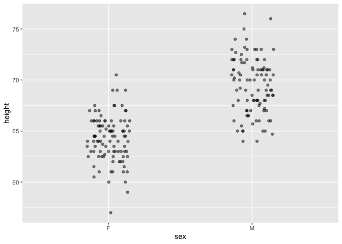
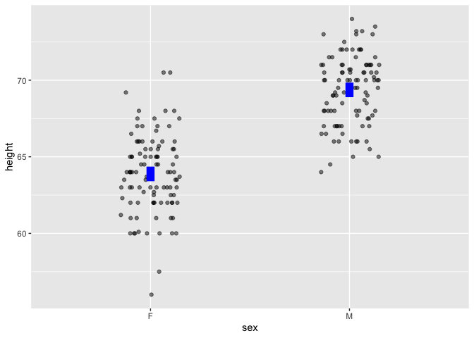
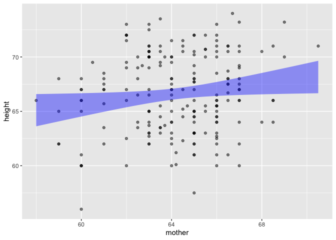
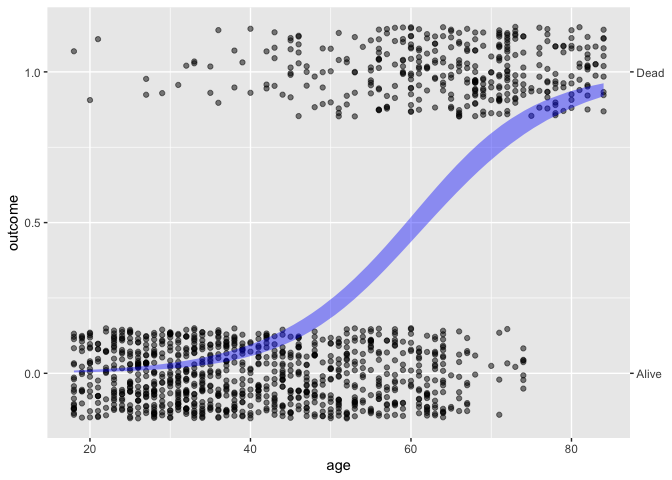
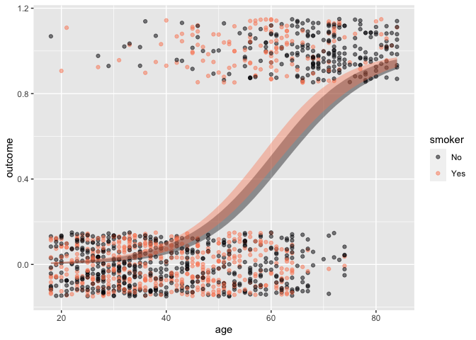

<!-- README.md is generated from README.Rmd. Please edit that file -->

# {LSTbook}: An R package for *Lessons in Statistical Thinking*

<!-- badges: start -->
<!-- badges: end -->

The `{LSTbook}` package provides software and datasets for [*Lessons in
Statistical
Thinking*](https://dtkaplan.github.io/Lessons-in-statistical-thinking/).

## Installation

We hope to have `{LSTbook}` available on CRAN by February 2024. In the
meanwhile, you can install the development version of `{LSTbook}` from
[GitHub](https://github.com/) with:

``` r
# install.packages("devtools")
devtools::install_github("dtkaplan/LSTbook")
```

## Overview

The `{LSTbook}` package has been developed to help students and
instructors learn and teach statistics and early data science.
`{LSTbook}` supports the 2024 textbook *Lessons in Statistical
Thinking*, but instructors may want to use `{LSTbook}` even with other
textbooks.

The statistics component of *Lessons* may fairly be called a radical
innovation. As an [introductory, university-level
course](https://dtkaplan.github.io/Math300blog/posts/StatChat-10-2023/),
*Lessons* gives students access to important modern themes in statistics
including modeling, simulation, co-variation, and causal inference. Data
scientists, who use data to make genuine decisions, will get the tools
they need. This includes a complete rethinking of statistical inference,
starting with confidence intervals very early in the course, then gently
introducing the structure of Bayesian inference. The coverage of
hypothesis testing has greatly benefited from the discussions prompted
by the American Statistical Association’s [*Statement on
P-values*](https://www.amstat.org/asa/files/pdfs/p-valuestatement.pdf)
and is approached in a way that, I hope, will be appreciated by all
sides of the debate.

The data-science part of the course includes the concepts and wrangling
needed to undertake statistical investigations (not including data
cleaning). It is based, as you might expect, on the tidyverse and
`{dplyr}`.

Some readers may be familiar with the `{mosaic}` suite of packages which
provides, for many students and instructors, their first framework for
statistical computation. But there have been many R developments since
2011 when `{mosaic}` was introduced. These include pipes and the
tidyverse style of referring to variables. `{mosaic}` has an uneasy
equilibrium with the tidyverse. In contrast, the statistical functions
in `{LSTbook}` fit in with the tidyverse style and mesh well with
`{dplyr}` commands.

The `{LSTbook}` function set is highly streamlined and internally
consistent. There is a tight set of only four object types produced by
the `{LSTbook}` computations:

- Data frames
- Graphic frames (`{ggplot2}` compatible but much streamlined)
- Models, which are summarized to produce either data frames or graphic
  frames.
- Data simulations (via DAGs) which are sampled from to produce data
  frames

Vignettes provide an instructor-level tutorial introduction to
`{LSTbook}`. The student-facing introduction is the *Lessons in
Statistical Thinking* textbook.

## Statistics for data science

Every instructor of introductory statistics is familiar with textbooks
that devote separate chapters to each of a half-dozen basic tests:
means, differences in means, proportions, differences in proportions,
and simple regression. It’s been known for a century that these topics
invoke the same statistical concepts. Moreover, they are merely
precursors to the essential multivariable modeling techniques used in
mainstream data-science tasks such as dealing with confounding.

To illustrate how `{LSTbook}` supports teaching such topics in a unified
and streamlined way, consider to datasets provided by the `{mosaicData}`
package: `Galton`, which contains the original data used by Francis
Galton in the 1880s to study the heritability of genetic traits,
specifically, human height; and `Whickham` results from a 20-year
follow-up survey to study smoking and health.

Start by installing `{LSTbook}` as described above, then loading it into
the R session:

``` r
library(LSTbook)
```

In the examples that follow, we will use the `{LSTbook}` function
`point_plot()` which handles both numerical and categorical variables
using one syntax. Here’s a graphic for looking at the difference between
two means.

``` r
Galton |> point_plot(height ~ sex)
```



Point plots can be easily annotated with models. To illustrate the
difference between the two means, add a model annotation:

``` r
Galton |> point_plot(height ~ sex, annot = "model")
```



Other `point_plot()` annotations are `violin` and `bw`.

In *Lessons*, models are always graphed in the context of the underlying
data and shown as confidence intervals.

The same graphics and modeling conventions apply to categorical
variables:

``` r
Whickham |> point_plot(outcome ~ smoker, annot = "model")
```


Simple regression works in the same way:

``` r
Galton |> point_plot(height ~ mother, annot = "model")
```



``` r
Whickham |> point_plot(outcome ~ age, annot = "model")
```



The syntax extends naturally to handle the inclusion of covariates. For
example, the simple calculation of difference between two proportions is
misleading; `age`, not smoking status, plays the primary role in
explaning mortality.

``` r
Whickham |> point_plot(outcome ~ age + smoker, annot = "model")
```



NOTE: To highlight statistical inference, we have been working with an
n=200 sub-sample of Galton:

``` r
Galton <- Galton |> take_sample(n=100, .by = sex)
```

Quantitative modeling has the same syntax, but rather than rely on the
default R reports for models, `{LSTbook}` offers concise summaries.

``` r
Whickham |> model_train(outcome ~ age + smoker) |> conf_interval()
#> Waiting for profiling to be done...
#> # A tibble: 3 × 4
#>   term          .lwr  .coef   .upr
#>   <chr>        <dbl>  <dbl>  <dbl>
#> 1 (Intercept) -8.50  -7.60  -6.77 
#> 2 age          0.110  0.124  0.138
#> 3 smokerYes   -0.124  0.205  0.537
```

To help students develop an deeper appreciation of the importance of
covariates, we can turn to data-generating simulations where we know the
rules behind the data and can check whether modeling reveals them
faithfully.

``` r
print(sim_08)
#> $names
#> $names[[1]]
#> c
#> 
#> $names[[2]]
#> x
#> 
#> $names[[3]]
#> y
#> 
#> 
#> $calls
#> $calls[[1]]
#> rnorm(n)
#> 
#> $calls[[2]]
#> c + rnorm(n)
#> 
#> $calls[[3]]
#> x + c + 3 + rnorm(n)
#> 
#> 
#> attr(,"class")
#> [1] "list"    "datasim"
dag_draw(sim_08)
```


From the rules, we can see that `y` increases directly with `x`, the
coefficient being 1. A simple model gets this wrong:

``` r
sim_08 |> 
  take_sample(n = 100) |>
  model_train(y ~ x) |>
  conf_interval()
#> # A tibble: 2 × 4
#>   term         .lwr .coef  .upr
#>   <chr>       <dbl> <dbl> <dbl>
#> 1 (Intercept)  2.75  3.01  3.27
#> 2 x            1.14  1.32  1.51
```

I’ll leave it as an exercise to the reader to see what happens when `c`
is included in the model as a covariate.

Finally, an advanced example that’s used as a demonstration but
illustrates the flexibility of unifying modeling, simulation, and
wrangling. We’ll calculate the width of the `x` confidence interval as a
function of the sample size `n` and averaging over 100 trials.

``` r
sim_08 |> 
  take_sample(n = sample_size) |>
  model_train(y ~ x) |>
  conf_interval() |>
  trials(times = 2, sample_size = c(100, 400, 1600, 6400, 25600)) |> 
  filter(term == "x") |> 
  mutate(width = .upr - .lwr)
#>    .trial sample_size term     .lwr    .coef     .upr      width
#> 1       1         100    x 1.372233 1.560350 1.748467 0.37623423
#> 2       2         100    x 1.332790 1.490733 1.648677 0.31588668
#> 3       1         400    x 1.421812 1.505607 1.589403 0.16759077
#> 4       2         400    x 1.499239 1.580337 1.661436 0.16219628
#> 5       1        1600    x 1.424356 1.466122 1.507888 0.08353176
#> 6       2        1600    x 1.436348 1.477919 1.519491 0.08314316
#> 7       1        6400    x 1.474246 1.494887 1.515529 0.04128310
#> 8       2        6400    x 1.487190 1.508327 1.529465 0.04227480
#> 9       1       25600    x 1.495289 1.505822 1.516355 0.02106636
#> 10      2       25600    x 1.498624 1.509280 1.519937 0.02131267
```

I’ve used only two trials to show the output of `trials()`, but increase
it to, say, `times = 100` and finish off the wrangling with the
`{dplyr}` function `summarize(mean(width), .by = sample_size)`.

    #>   sample_size mean(width)
    #> 1         100  0.34800368
    #> 2         400  0.17059320
    #> 3        1600  0.08483481
    #> 4        6400  0.04251015
    #> 5       25600  0.02123563
