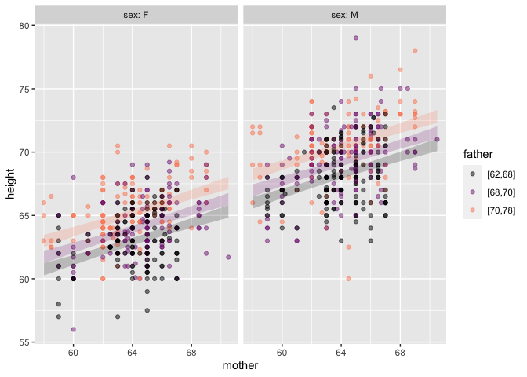

<!-- README.md is generated from README.Rmd. Please edit that file -->

# {LST}: An R package for *Lessons in Statistical Thinking*

<!-- badges: start -->
<!-- badges: end -->

The `{LST}` package provides software and datasets for *Lessons in
Statistical Thinking*.

## Installation

We hope to have `{LST}` available on CRAN by early 2004. In the
meanwhile, you can install the development version of LST from
[GitHub](https://github.com/) with:

``` r
# install.packages("devtools")
devtools::install_github("dtkaplan/LST")
```

## Overview

The `{LST}` package has been developed to help students and instructors
learn and teach statistics and early data science. `{LST}` supports the
new textbook (still in draft) *Lessons in Statistical Thinking*, but
instructors may want to use `{LST}` even with other textbooks.

The statistics component of *Lessons* may fairly be called a radical
innovation. As an [introductory, university-level
course](https://dtkaplan.github.io/Math300blog/posts/StatChat-10-2023/),
*Lessons* gives students access to important modern themes in statistics
including modeling, simulation, co-variation, and causal inference. Data
scientists, who use data to make genuine decisions, will get the tools
they need. This includes a complete rethinking of statistical inference,
starting with confidence intervals very early in the course, then gently
introducing the structure of Bayesian inference. The coverage of
hypothesis testing has greatly benefited from the discussions prompted
by the American Statistical Association’s [*Statement on
P-values*](https://www.amstat.org/asa/files/pdfs/p-valuestatement.pdf)
and is approached in a way that, I hope, will be appreciated by all
sides of the debate.

The data-science part of the course includes the concepts and wrangling
needed to undertake statistical investigations (not including data
cleaning). It is based, as you might expect, on the tidyverse and
`{dplyr}`.

Some readers may be familiar with the `{mosaic}` suite of packages which
provides, for many students and instructors, their first framework for
statistical computation. But there have been many R developments since
2011 when `{mosaic}` was introduced. These include pipes and the
tidyverse style of referring to variables. `{mosaic}` has an uneasy
equilibrium with the tidyverse. In contrast, the statistical functions
in `{LST}` fit in with the tidyverse style and mesh well with `{dplyr}`
commands.

The `{LST}` function set is highly streamlined and internally
consistent. There is a tight set of only four object types produced by
the `{LST}` computations:

- Data frames
- Graphic frames (`{ggplot2}` compatible but much streamlined)
- Models, which are summarized to produce either data frames or graphic
  frames.
- Data simulations (via DAGs) which are sampled from to produce data
  frames

Vignettes provide an instructor-level tutorial introduction to `{LST}`.
The student-facing introduction is the *Lessons in Statistical Thinking*
textbook.

## Quick introduction

``` r
library(LST)
```

From the start of the course, students make data graphics designed to
support modeling. The `pointplot()` function provides access to powerful
graphics intended to develop statistical reasoning abilities but is very
easy to use. For instance, using Francis Galton’s data from the 1880s,
let’s look at a (fully-grown) child’s height as a function of his or her
parents height. (This example moves faster than we do with students!)
Relationships are clear when the data are annotated with a model.

``` r
mosaicData::Galton |>
  pointplot(height ~ mother + father + sex, annot = "model")
```



Quantitative modeling has the same syntax, but rather than rely on the
default R reports for models, `{LST}` offers concise summaries.

``` r
mosaicData::Galton |> 
  model_train(height ~ mother + father + sex) |>
  conf_interval()
#> # A tibble: 4 × 4
#>   term         .lwr  .coef   .upr
#>   <chr>       <dbl>  <dbl>  <dbl>
#> 1 (Intercept) 9.95  15.3   20.7  
#> 2 mother      0.260  0.321  0.383
#> 3 father      0.349  0.406  0.463
#> 4 sexM        4.94   5.23   5.51
```

To develop an appreciation of the importance of covariates, we can turn
to data-generating simulations where we know the rules behind the data
and can check whether modeling reveals them faithfully.

``` r
print(sim_08)
#> Simulation object
#> ------------
#> [1] c <- rnorm(n)
#> [2] x <- c + rnorm(n)
#> [3] y <- x + c + 3 + rnorm(n)
dag_draw(sim_08)
```


From the rules, we can see that `y` increases directly with `x`, the
coefficient being 1. A simple model gets this wrong:

``` r
sim_08 |> 
  sample(n = 100) |>
  model_train(y ~ x) |>
  conf_interval()
#> # A tibble: 2 × 4
#>   term         .lwr .coef  .upr
#>   <chr>       <dbl> <dbl> <dbl>
#> 1 (Intercept)  2.74  2.98  3.22
#> 2 x            1.30  1.45  1.60
```

I’ll leave it as an exercise to the reader to see what happens when `c`
is included in the model as a covariate.

Finally, an advanced example that’s used as a demonstration but
illustrates the flexibility of unifying modeling, simulation, and
wrangling. We’ll calculate the width of the `x` confidence interval as a
function of the sample size `n` and averaging over 100 trials.

``` r
sim_08 |> 
  sample(n = n) |>
  model_train(y ~ x) |>
  conf_interval() |>
  trials(times = 2, n = c(100, 400, 1600)) |> 
  filter(term == "x") |> 
  mutate(width = .upr - .lwr)
#>   .trial    n term     .lwr    .coef     .upr      width
#> 1      1  100    x 1.521538 1.717093 1.912649 0.39111092
#> 2      2  100    x 1.234374 1.417474 1.600574 0.36620068
#> 3      1  400    x 1.390188 1.478836 1.567485 0.17729708
#> 4      2  400    x 1.519035 1.603670 1.688305 0.16926959
#> 5      1 1600    x 1.430024 1.472944 1.515865 0.08584056
#> 6      2 1600    x 1.436323 1.478510 1.520697 0.08437371
```

I’ve used only two trials to show the output of `trials()`, but increase
it to, say, `times = 100` and finish off the wrangling with the
`{dplyr}` function `summarize(mean(width), .by = n)`.

    #>       n mean(width)
    #> 1   100  0.35343367
    #> 2   400  0.17076383
    #> 3  1600  0.08503046
    #> 4  6400  0.04251642
    #> 5 25600  0.02119462
